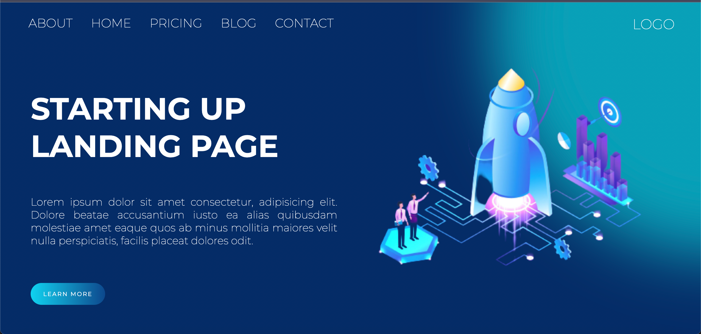

# Landing Page 

## Descrição do projeto 

Projeto com a finalidade de desenvolver as técnicas de HTML e CSS. Projeto simples que ainda precisa de melhorias como por exemplo repsponsividade.

 
## ✔️ Técnicas e tecnologias utilizadas

- ``HTML 5``
- ``CSS 3``

## 📁 Acesso ao projeto
Você pode acessar os arquivos do projeto clicando [aqui](https://github.com/Filip3C0/landing-page).
